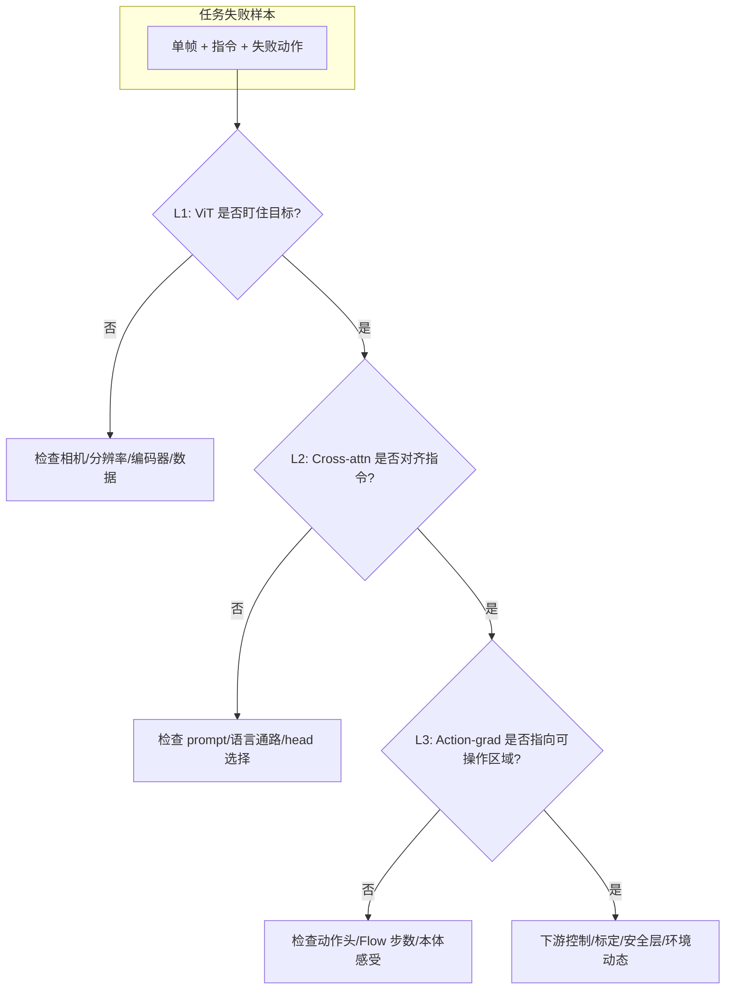

# 28. VLA 调试与可解释性：三层视觉归因方法

> 本文档整理自 ViT 注意力可视化、跨模态 cross-attention 与动作梯度归因相关讨论，用于 VLA 故障排查与模型行为诊断。

[⬅️ 返回 VLA 目录](./README.md) | [19. VLA 架构](./19_VLA_Architecture.md) | [22f. π0 部署 FAQ](./22f_Pi0_Deployment_FAQ.md) | [VLM/S2 视觉接地](../VLM_Advances/VLM_S2_Visual_Grounding.md)

---

## 1. 为什么需要三层归因？

VLA 典型流水线（见 [19. VLA 架构](./19_VLA_Architecture.md)）：

```
[RGB 图像] → ViT 视觉编码器 → 视觉 Token → LLM 骨干 → 动作解码头 → [机器人动作]
```

文档中反复强调：**视觉编码器是「眼睛」——这里漏掉的信息，后面再强的 LLM 也补不回来**（见 [VLM/S1 视觉编码器](../VLM_Advances/VLM_S1_Vision_Encoder_Evolution.md)）。

许多失败看起来像「动作头/规划错了」，根因却是上游看错区域。因此建议按三层分别诊断，而不是只看最终动作误差。

| 层级 | 回答的问题 | 典型方法 |
|------|------------|----------|
| **L1 视觉编码（ViT）** | 「眼睛」在看画面的哪里？ | Self-attention 热力图、Attention Rollout、LRP |
| **L2 多模态融合（LLM）** | 语言/动作 query 在 attend 哪些视觉 Token？ | Text→image cross-attention、localization heads |
| **L3 决策输出（动作头）** | 哪些图像区域因果地影响该步动作？ | Grad-CAM、对动作/flow loss 的梯度归因 |

> **注意**：很少有顶会论文把三层写成固定「决策链 pipeline」；更多是分别研究某一类方法，或在工具/诊断框架中组合使用（见第 6 节文献）。

---

## 2. L1：ViT 视觉注意力热力图

### 2.1 意义

- 检查 SigLIP / CLIP / DINOv2 等编码器是否把表征集中在**任务相关物体**（抓取目标、把手、障碍物）。
- 区分「语义知道有杯子」与「空间上对准杯子」——后者对机器人操作至关重要（见 [VLM/S2](../VLM_Advances/VLM_S2_Visual_Grounding.md)、[附录 B 双编码器](./Appendix_B_Dual_Vision_Encoder.md)）。
- 用于数据清洗、多视角标定、域迁移（换 FOV/相机位姿后对比同一帧热力图，见 [22f FAQ](./22f_Pi0_Deployment_FAQ.md)）。

### 2.2 常见现象与含义

| 现象 | 可能含义 |
|------|----------|
| 热力集中在背景/机械臂本体 | 表征被干扰，下游难以对准目标 |
| 目标很小但热力很散 | 分辨率/裁剪/FOV 导致小物体编码弱 |
| 多相机仅某一视角有热点 | 多视角融合或外参可能有问题 |

### 2.3 方法要点

- **Raw attention**：单层、单头权重，易误导，不建议单独作为结论。
- **Attention Rollout**（Abnar & Zuidema, ACL 2020）：多层 self-attention 合成到输入 patch；需对 residual 做 `(A + I) / 2` 修正。
- **Chefer LRP + 梯度**（CVPR 2021）：类判别、比纯 attention 更 faithful，ViT 分类/检测常用。

### 2.4 局限

- Attention 权重 **≠** 因果重要性（Jain & Wallace, NAACL 2019）。
- 纯 ViT self-attention **看不到文本指令**；指令对齐需 L2。

---

## 3. L2：LLM → 视觉 Cross-Attention

### 3.1 意义

在 LLaVA / PaliGemma / OpenVLA 等架构中，语言 Token 或动作 Token 作为 **Query**，视觉 Token 作为 **Key/Value**。Cross-attention 热力图表示：**当前正在生成的文本/动作，在融合哪些图像区域的信息**。

π₀ 类模型的动作头亦常用 Cross-Attention（Q=动作 Token，K/V=视觉+语言），见 [附录 A Flow Matching](./Appendix_A_Flow_Matching.md)。

### 3.2 与 Grounding 的关系

Visual Grounding 要求模型输出「在哪里」而不只是「是什么」。Cross-attention 是检查 **指令是否与正确图像区域绑定** 的直接探针。

研究发现（NOTICE, NAACL 2025）：

- **BLIP** 中 universal **cross-attention** heads 承担 object detection / suppression 等 grounding 功能。
- **LLaVA** 中重要的 self-attention heads 多为 outlier suppression；**grounding 更依赖少数 localization heads**（Kang et al., CVPR 2025），而非所有头平均。

### 3.3 实践建议

- 对 REC 类任务：看生成目标名词（如 `cup`）时，text→image attention 是否落在对应物体 patch。
- 不要对所有 head 取平均；优先筛选 **localization heads** 或 NOTICE 识别的 universal heads。
- 工具参考：[VL-InterpreT](https://arxiv.org/abs/2203.17247)、[VLM-Visualizer](https://github.com/zjysteven/VLM-Visualizer)、[Attention-LLaVA](https://github.com/junyangwang0410/Attention-LLaVA)。

---

## 4. L3：Action-Gradient（以动作为目标的梯度归因）

### 4.1 意义

对 **动作向量、flow matching loss、或某一维 Δx/Δy** 求 ∂/∂(中间特征)，得到「哪些空间位置的变化最影响该步动作」。这比 L1/L2 更接近 **决策因果**，但仍需与干预实验（mask/knockout）交叉验证。

### 4.2 在 VLA 中的用法

| 目标 | 反传对象 | 典型 hook 位置 |
|------|----------|----------------|
| 自回归动作 Token | 下一 token 的 CE loss | LLM 最后一层 + 视觉 Token |
| Flow Matching / 扩散动作 | velocity loss 或 denoising loss | 动作头 Cross-Attention 的 K/V（视觉+语言） |
| 单维连续动作 | 标量输出 ∂/∂features | 动作 MLP 或 diffusion head 输入 |

经典 **Grad-CAM**（Selvaraju et al., ICCV 2017）原论文已覆盖 VQA；思路可直接迁移到 VLA。

### 4.3 机器人/VLA 相关研究

- **GNFactor**（CoRL 2023）：3D 策略模块 Grad-CAM，验证是否盯住目标物体。
- **Perception Stitching**（arXiv 2024）：visuomotor policy 的 Grad-CAM 对比。
- **Mechanistic Interpretability for Steering VLAs**（Häon et al., CoRL 2025）：FFN 激活 steering（π₀、OpenVLA），偏机制干预而非热力图。
- **VLA-Trace**（arXiv 2026）：attention knockout + localization + 输入编辑，面向 π₀.₅ / OpenVLA 的系统诊断。

---

## 5. 推荐调试流程



### 5.1 快速检查清单

1. **L1**：目标物体 bbox 内是否有足够热点？机械臂/背景是否「抢注意力」？
2. **L2**：说「抓红色杯子」时，生成相关 token 的 cross-attn 是否在红杯 patch？
3. **L3**：对失败步动作求 grad，热点是否在夹爪可达区域？
4. **干预验证**：遮挡目标 / knock out 某层 attention head，动作是否显著变化？（比只看热力图更可靠）

### 5.2 失败归因对照

| 症状 | 优先查层 |
|------|----------|
| 完全抓空、目标在视野但动作偏离 | L1 → L2 |
| 执行错误物体（多物体场景） | L2 → L3 |
| 大体对准但毫米级偏差 | L3、动作表示精度（见 [20](./20_Action_Tokenization.md)） |
| 换相机后性能骤降 | L1 + 部署 FAQ 中的 FOV/安装（[22f](./22f_Pi0_Deployment_FAQ.md)） |

---

## 6. 文献与工具索引

### 6.1 ViT / Self-Attention 可视化

| 文献 | 链接 | 用途 |
|------|------|------|
| Abnar & Zuidema, ACL 2020 — *Quantifying Attention Flow in Transformers* | [arXiv:2005.00928](https://arxiv.org/abs/2005.00928) | Attention Rollout / Flow |
| Chefer et al., CVPR 2021 — *Transformer Interpretability Beyond Attention Visualization* | [arXiv:2012.09838](https://arxiv.org/abs/2012.09838) | ViT LRP + 梯度 + rollout |
| Jain & Wallace, NAACL 2019 — *Attention is not Explanation* | — | 读热力图时的警示 |
| Chefer 官方代码 | [GitHub](https://github.com/hila-chefer/Transformer-Explainability) | ViT 热力图复现 |

### 6.2 VLM Cross-Attention / Grounding

| 文献 | 链接 | 用途 |
|------|------|------|
| Aflalo et al., CVPR 2022 — *VL-InterpreT* | [arXiv:2203.17247](https://arxiv.org/abs/2203.17247) | 跨模态 + 模态内 attention 交互工具 |
| Rudman et al., NAACL 2025 — *What Do VLMs NOTICE?* | [arXiv:2406.16320](https://arxiv.org/abs/2406.16320) | Universal heads、因果 patching |
| Kang et al., CVPR 2025 — *Few Attention Heads For Visual Grounding* | [CVPR PDF](https://openaccess.thecvf.com/content/CVPR2025/papers/Kang_Your_Large_Vision-Language_Model_Only_Needs_A_Few_Attention_Heads_CVPR_2025_paper.pdf) | Localization heads、免训练 grounding |
| Zhao et al., ICML 2024 — *Grad-ECLIP* | [PMLR](https://proceedings.mlr.press/v235/zhao24p.html) | CLIP ViT 梯度解释 |
| Q-GroundCAM | [arXiv:2404.19128](https://arxiv.org/abs/2404.19128) | GradCAM 量化 VLM grounding |
| CREG | [arXiv:2603.20475](https://arxiv.org/abs/2603.20475) | 对比 rollout vs 梯度归因（空间推理） |

### 6.3 梯度归因 / 机器人策略

| 文献 | 链接 | 用途 |
|------|------|------|
| Selvaraju et al., ICCV 2017 — *Grad-CAM* | [arXiv:1610.02391](https://arxiv.org/abs/1610.02391) | 多模态/VQA 梯度热力图基线 |
| Ze et al., CoRL 2023 — *GNFactor* | [项目页](https://yanjieze.com/GNFactor/) | 3D 策略 Grad-CAM |
| Häon et al., CoRL 2025 — *Mechanistic Interpretability for Steering VLAs* | [arXiv:2509.00328](https://arxiv.org/abs/2509.00328) | π₀ / OpenVLA 表征 steering |
| VLA-Trace | [arXiv:2605.30117](https://arxiv.org/abs/2605.30117) | VLA 表征 + attention 干预诊断 |
| *Not All Features Are Created Equal* | [arXiv:2603.19233](https://arxiv.org/abs/2603.19233) | VLA 机制解释（SAE、通路分工） |

### 6.4 开源工具（非论文）

- [VLM-Visualizer](https://github.com/zjysteven/VLM-Visualizer) — 组合 LLM 与 ViT attention
- [Attention-LLaVA](https://github.com/junyangwang0410/Attention-LLaVA) — LLaVA 注意力插件

---

## 7. 架构差异速查

| 模型族 | L1（ViT） | L2（融合） | L3（动作） |
|--------|-----------|------------|------------|
| **OpenVLA / LLaVA 系** | SigLIP 或双编码器 ViT | LLM self + 视觉 Token 交叉 | 自回归动作 Token → 对目标 token grad |
| **π₀ / PaliGemma** | SigLIP ViT-So400m | Gemma 双向/掩码 attention | Flow Matching 头：对 velocity loss、动作 Cross-Attn |
| **RT-2 系** | ViT + PaLM 融合 | 早期融合或 cross-attn | 离散动作 bin 的 next-token grad |

---

## 8. 核心结论

1. **ViT 热力图**回答「眼睛是否看对地方」——VLA 上游瓶颈，宜先做。
2. **Cross-attention**回答「指令/动作 query 是否用到正确视觉 Token」——Grounding 与多物体场景的关键。
3. **Action-gradient**回答「哪些区域因果影响该步动作」——最接近控制决策，需配合 mask/knockout 验证。
4. **三层联合是工程实践，不是某一篇论文的固定 recipe**；读图时务必参考 Jain 2019 / CREG 等对 attention faithfulness 的讨论。
5. VLA 部署 FAQ 指出**可解释性不足**是产线排查障碍之一；本文档方法可作为黑盒策略的定性诊断补充，不能替代安全认证与定量评测。

---

## 9. 关联阅读

- [17. VLA 概述](./17_VLA_Overview.md) — 输入输出与失败代价
- [19. VLA 架构](./19_VLA_Architecture.md) — 三段式流水线
- [22f. π0 部署 FAQ](./22f_Pi0_Deployment_FAQ.md) — 黑盒排查、相机域迁移
- [VLM/S2 视觉接地](../VLM_Advances/VLM_S2_Visual_Grounding.md) — 从理解到定位
- [VLM/S1 视觉编码器](../VLM_Advances/VLM_S1_Vision_Encoder_Evolution.md) — SigLIP vs DINOv2 与空间感知

---

*文档版本：2026-06 · 来源：ViT 注意力可视化与 VLA 可解释性讨论整理*
