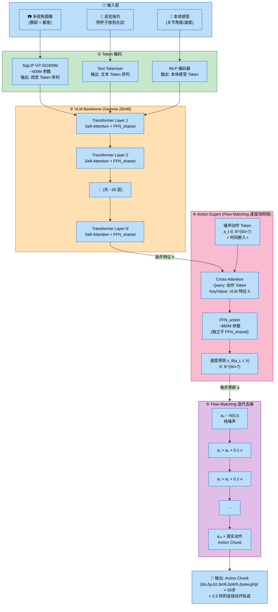
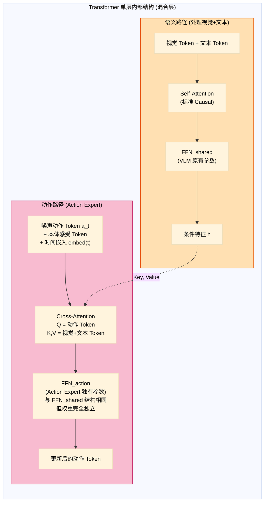
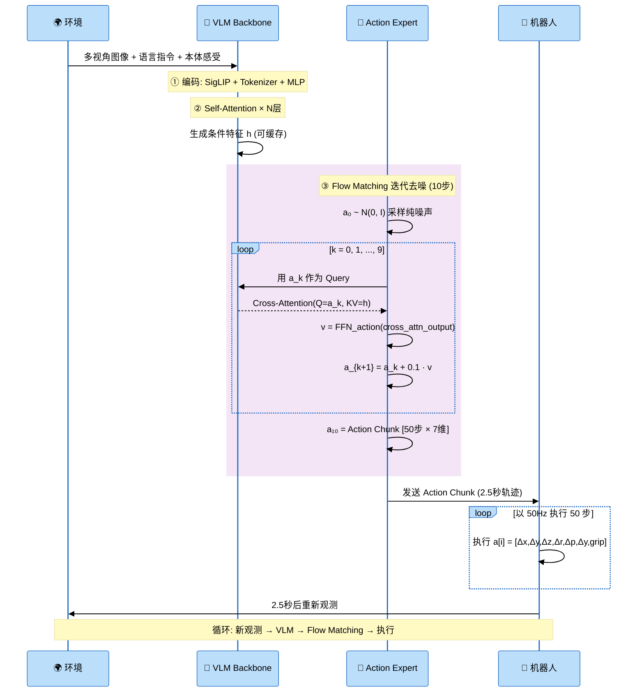

# 附录 A：Flow Matching 原理详解

> **前置知识**：[19. VLA 架构](./19_VLA_Architecture.md)（扩散范式章节）、[20. 动作表示](./20_Action_Tokenization.md)（为什么不用 Regression Head）

---

## 1. 从 Diffusion 到 Flow Matching：为什么需要一种新范式？

### (a) Diffusion 模型的成功与局限

**DDPM (Denoising Diffusion Probabilistic Models)** 是生成模型领域的里程碑，在图像、音频、动作生成中取得了巨大成功。它的核心思路是：

```
前向过程（加噪）:  真实数据 x₀ → x₁ → x₂ → ... → x_T ≈ 纯噪声 N(0, I)
反向过程（去噪）:  纯噪声 x_T → x_{T-1} → ... → x₁ → x₀ ≈ 生成数据
```

但 DDPM 有几个实际问题：

| 问题 | 说明 |
| :--- | :--- |
| **推理步数多** | 需要 50-1000 步去噪迭代，每步都要做一次神经网络前向推理 |
| **路径弯曲** | 从噪声到数据的路径是弯曲的随机游走（SDE），不是最短路径 |
| **训练目标间接** | 训练的是"噪声预测 ε_θ"，需要间接转换为数据方向 |
| **理论复杂** | 基于 SDE/随机微分方程，数学推导冗长 |

```
DDPM 的路径（弯曲的随机游走）:

噪声 x_T ─╮
           │╲
           │  ╲         弯弯曲曲的路径
           │    ╲       需要很多步才能走完
           │     ╲╮
           │      │╲
           │      │  ╲
           ╰──────╯   → 数据 x₀

路径曲率 ≈ 3.45（实测，非最优）
```

### (b) Flow Matching 的核心直觉

**Flow Matching 的核心思想极其简单：为什么不走直线？**

```
Flow Matching 的路径（接近直线）:

噪声 x₁ ─────────────────→ 数据 x₀

路径曲率 ≈ 1.02（接近理想直线）
步数: 5-20 步即可达到高质量生成（vs DDPM 的 50-1000 步）
```

这就是 Flow Matching 的全部直觉——学习一个**速度场 (velocity field)**，让数据沿着近似直线从噪声流向真实分布。

---

## 2. 数学基础：连续正则化流 (CNF)

### (a) 什么是"流 (Flow)"？

在数学中，**流**是一个随时间变化的映射，将点从一个位置"搬运"到另一个位置。

**定义**：流 $\phi_t: \mathbb{R}^d \to \mathbb{R}^d$ 是一族参数为时间 $t \in [0, 1]$ 的微分同胚（可逆、光滑的映射），满足：

**常微分方程 (ODE)**：

$$\frac{dx}{dt} = v_t(x)$$

其中 $v_t$ 是速度场 (velocity field)。

**初始条件与解**：

$$x(0) = x_0 \sim p_0 \quad \text{(t=0 时从噪声分布出发)}$$

$$x(1) \sim p_1 \quad \text{(t=1 时到达数据分布)}$$

$$\phi_t(x_0) = x_0 + \int_0^t v_s(\phi_s(x_0)) \, ds$$

**直觉理解**：想象一大群粒子，每个粒子代表一个样本。速度场 $v_t$ 告诉每个粒子在每个时刻该往哪个方向移动、移动多快。当所有粒子按照速度场流动，它们会从噪声分布"流向"数据分布。

> **深入理解 $\phi_t$ 函数**
>
> $\phi_t(x_0)$ 回答的问题是：**一个从 $x_0$ 出发的粒子，经过时间 $t$ 后，走到了哪里？**
>
> 拆解公式 $\phi_t(x_0) = x_0 + \int_0^t v_s(\phi_s(x_0)) \, ds$：
> - $x_0$：粒子的**起点**（初始位置）
> - $v_s(\cdot)$：在时刻 $s$、位置 $\cdot$ 处的**速度场**（告诉粒子该往哪走、走多快）
> - $\phi_s(x_0)$：粒子在时刻 $s$ 的**实时位置**（递归定义——速度取决于当前位置，当前位置又取决于之前的速度）
> - $\int_0^t$：把从 0 到 $t$ 每个瞬间的速度**累加**起来
>
> 整个公式就是说：**终点 = 起点 + 沿途所有速度的累积**。

**类比：河流中的落叶。** 想象一条蜿蜒的河流，水面各处的水流方向和速度不同：

```
河流速度场 v_s(位置):
  河中央: 向下游 2m/s
  河岸边: 向下游 0.5m/s
  弯道处: 向侧面偏转

一片落叶掉在位置 x₀ = 河中央:
  t=0s:  φ₀(x₀) = x₀                    ← 还在原地
  t=1s:  φ₁(x₀) = x₀ + 约 2m (下游)      ← 被河中央的快流冲了 2m
  t=2s:  φ₂(x₀) = x₀ + 约 4m             ← 如果还在中央，继续快
  
  但如果落叶在 t=1s 时漂到了河岸边:
  t=2s:  φ₂(x₀) = φ₁(x₀) + 约 0.5m      ← 速度变慢了！
         因为 v₂(φ₂处的位置) = 0.5m/s (岸边)

关键: 落叶在每一刻的速度，取决于它当时所在位置的水流
     → v_s(φ_s(x₀)) 中嵌套的含义: 速度场在"粒子当前位置"处取值
```

**在 Flow Matching 中的实际含义：**

```
  x₀ ~ N(0,I)  = 一团噪声 (比如 [0.73, -1.2, 0.05, ...] 共 350 维)
  x₁            = 一条真实的机器人动作轨迹

  φ_t(x₀) = 噪声 x₀ 在速度场驱动下，经过时间 t 后变成的样子

  t=0.0:  φ₀(x₀) = x₀           ← 纯噪声，毫无意义
  t=0.3:  φ₀.₃(x₀) = 略有结构    ← 开始有点像动作
  t=0.7:  φ₀.₇(x₀) = 大致成型    ← 能看出是在"抓杯子"
  t=1.0:  φ₁(x₀) ≈ x₁           ← 变成了一条完整的抓杯子轨迹

  每一步 φ_t 都是同一个噪声粒子在速度场中的位置快照
  整条轨迹 {φ_t(x₀)} (t ∈ [0,1]) 就是这个粒子从噪声"流向"真实动作的完整路线
```

**为什么需要积分（多步推理）而不能一步到位？** 因为速度场 $v_s$ 是**位置相关的**——你在不同位置看到的"方向指示"不同。你必须一步步走，每走一步就根据新位置查询新的方向。这就是为什么推理时需要 10 步 Euler 积分，而不是一步到位。

```
不能一步到位:   φ₁(x₀) ≠ x₀ + 1.0 · v₀(x₀)   ← 只用起点速度走一大步，会偏
实际做法:       分 10 小步，每步查询当前位置的速度 ← Euler 积分
```

```
t=0 (噪声分布)              t=0.5 (中间状态)              t=1 (数据分布)
                            
 · · ·  · · ·               ·  ··  ·                    ··
·   ·· · ·  ·         ·  ··     ··               ··    ···
  · ·  · ·· ·           ··   · ·  ·                ···  ··
· ·  ·  · · ·           · ··· ·                   ···
  ···  ·  · ·              · ··· ·                  ····

  均匀散布                 开始聚集                  形成数据结构
  (高斯噪声)                                        (如图像/动作)
```

### (b) 连续正则化流 (CNF)

CNF 是流的神经网络参数化版本：

**CNF 定义**：

$$\frac{dx}{dt} = v_\theta(x, t)$$

其中 $\theta$ 是可学习参数。目标：找到 $\theta$ 使得流 $\phi_t$ 将 $p_0$ (噪声) 映射到 $p_1$ (数据)，即 $(\phi_1)_\# p_0 = p_{\text{data}}$。

**概率密度的变化**遵循连续性方程（类似流体力学）：

$$\frac{\partial p_t}{\partial t} + \nabla \cdot (p_t \cdot v_t) = 0$$

> **连续性方程的详细解释**
>
> 这个方程是 Flow Matching 的理论基石之一，它保证了"从噪声到数据"的流变换在概率意义上是合法的。下面逐项拆解。
>
> **三个组成部分**：
>
> | 项 | 含义 | 直觉 |
> |:---|:---|:---|
> | $\frac{\partial p_t}{\partial t}$ | 概率密度在某个固定位置 $x$ 处随时间的变化率 | "这个位置的粒子是变多了还是变少了？" |
> | $\nabla \cdot (p_t \cdot v_t)$ | 概率通量的散度——粒子在速度场驱动下流入/流出某个区域的净速率 | "粒子是净流入还是净流出这个区域？" |
> | $= 0$ | 两者之和为零——概率守恒 | "粒子不会凭空产生或消失" |
>
> **类比 1：交通流量守恒**
>
> 把 $p_t(x)$ 想象成城市某条路段 $x$ 在时刻 $t$ 的车辆密度：
> - 如果某路段车辆密度增加（$\frac{\partial p_t}{\partial t} > 0$），一定是因为流入的车比流出的多（$\nabla \cdot (p_t \cdot v_t) < 0$，净流入）
> - 如果某路段车辆密度减少，一定是因为流出的车比流入的多
> - 车不会凭空出现或消失（没有"传送门"），所以两项之和为零
>
> **类比 2：水流中的墨水**
>
> 在流动的水中滴一滴墨水，墨水会被水流带走。连续性方程描述的是：在任意一个观察点，墨水浓度的变化完全由水流的搬运决定：
> - 水流把墨水从上游带来 → 浓度升高
> - 水流把墨水冲向下游 → 浓度降低
> - 墨水总量守恒（不蒸发、不生成）

> **在 Flow Matching 中的意义**
>
> 连续性方程保证了：当我们用速度场 $v_t$ 把大量噪声粒子 $x_0 \sim \mathcal{N}(0, I)$ "搬运"到目标位置时，整个过程中概率质量是守恒的。
>
> ```
> t=0:   p₀ = N(0, I)                  ← 均匀散布的噪声粒子
>        某区域 A 内有 30% 的粒子
>
> t=0.5: 速度场把粒子向数据集中的区域推
>        区域 A 内的粒子被推走一部分 → p(A) 减少
>        数据密集区域 B 有粒子涌入 → p(B) 增加
>        但 p(A) + p(B) + ... = 1      ← 总概率守恒
>
> t=1:   p₁ ≈ p_data                   ← 粒子聚集到数据分布
>        所有概率质量都被合法地"搬运"到了正确位置
> ```
>
> 如果没有这个约束，速度场可能把 90% 的概率质量搬到某一个点，剩下 10% 丢掉——这会导致生成的样本高度集中（mode collapse）或概率不归一（不是合法的分布）。
>
> **散度 $\nabla \cdot$ 的直觉**
>
> 散度衡量的是"一个点的速度场是向外扩散还是向内汇聚"：
> - $\nabla \cdot v > 0$（正散度）：速度场从该点向外发散 → 粒子被推走 → 密度下降
> - $\nabla \cdot v < 0$（负散度）：速度场向该点汇聚 → 粒子被吸引来 → 密度升高
> - $\nabla \cdot v = 0$：速度场只是"路过"该点，流入 = 流出 → 密度不变
>
> ```
> 正散度 (粒子被推散):      负散度 (粒子被吸引):      零散度 (粒子路过):
>
>       ↗                        ↘  ↙                      →  →
>  ← · →                         · ↑                      →  →
>       ↘                        ↗  ↖                      →  →
>
> 密度在此点下降              密度在此点升高              密度在此点不变
> ```

---

## 3. Flow Matching 核心算法

### (a) 总体框架

Flow Matching 的训练目标是：**让神经网络 $v_\theta(x, t)$ 拟合一个已知的目标速度场 $u_t(x)$**

**Flow Matching 损失**：

$$\mathcal{L}_{\text{FM}}(\theta) = \mathbb{E}_{t \sim U[0,1],\, x \sim p_t} \left[ \| v_\theta(x, t) - u_t(x) \|^2 \right]$$

其中：
- $t \sim U[0, 1]$：时间均匀采样
- $x \sim p_t$：从 $t$ 时刻的分布中采样
- $u_t(x)$：目标速度场（已知的理想速度场）
- $v_\theta(x, t)$：神经网络预测的速度场

**问题**：目标速度场 $u_t(x)$ 和边际分布 $p_t$ 是无法直接计算的——它们依赖于整个数据集的全局信息。

### (b) 条件 Flow Matching (CFM)：关键突破

**Conditional Flow Matching** 通过"条件化"解决了上述问题——不看全局，只看**以单个数据点为条件**的局部速度场。

**条件 Flow Matching 损失**：

$$\mathcal{L}_{\text{CFM}}(\theta) = \mathbb{E}_{t \sim U[0,1],\, x_1 \sim p_{\text{data}},\, x \sim p_t(\cdot | x_1)} \left[ \| v_\theta(x, t) - u_t(x \mid x_1) \|^2 \right]$$

其中：
- $x_1 \sim p_{\text{data}}$：从训练集采样一个真实数据点
- $p_t(x \mid x_1)$：以 $x_1$ 为条件的概率路径
- $u_t(x \mid x_1)$：以 $x_1$ 为条件的速度场（可以解析计算！）

**关键定理（Lipman et al., 2023）**：

> $\mathcal{L}_{\text{CFM}}(\theta)$ 与 $\mathcal{L}_{\text{FM}}(\theta)$ 具有相同的梯度：
>
> $$\nabla_\theta \mathcal{L}_{\text{CFM}}(\theta) = \nabla_\theta \mathcal{L}_{\text{FM}}(\theta)$$
>
> **证明直觉**：对所有条件 $x_1$ 取期望后，条件速度场恢复为边际速度场，因此优化 $\mathcal{L}_{\text{CFM}}$ 等价于优化 $\mathcal{L}_{\text{FM}}$。

这意味着：**我们可以用简单的条件速度场来训练，但得到的模型能拟合全局速度场！**

### (c) 高斯概率路径

最常用的概率路径是**线性插值路径（Optimal Transport 路径）**：

**线性插值路径**：

$$p_t(x \mid x_1) = \mathcal{N}(x;\, \mu_t(x_1),\, \sigma_t^2 I)$$

其中：

$$\mu_t(x_1) = t \cdot x_1 \quad \text{(均值从 0 线性移到 } x_1\text{)}$$

$$\sigma_t = 1 - (1-\sigma_{\min}) \cdot t \quad \text{(方差从 1 线性缩小到 } \sigma_{\min} \approx 0\text{)}$$

**采样方式**：

$$x = \mu_t(x_1) + \sigma_t \cdot \varepsilon, \quad \varepsilon \sim \mathcal{N}(0, I)$$

简化版（$\sigma_{\min} \to 0$）：

$$x_t = t \cdot x_1 + (1-t) \cdot x_0, \quad x_0 \sim \mathcal{N}(0, I),\; x_1 \sim p_{\text{data}}$$

**对应的条件速度场：**

$$u_t(x \mid x_1) = \frac{x_1 - (1-\sigma_{\min}) \cdot x}{1 - (1-\sigma_{\min}) \cdot t}$$

简化版（$\sigma_{\min} \to 0$）：

$$u_t(x \mid x_1) = \frac{x_1 - x}{1 - t}$$

更简洁的表达：

$$u_t(x_t \mid x_1) = x_1 - x_0 = x_1 - \varepsilon$$

即：**速度场就是"数据减去噪声"的方向！**

---

## 4. 完整训练与推理流程

### (a) 训练流程

```
╔══════════════════════════════════════════════════════════════════════╗
║                    Flow Matching 训练流程                            ║
╠══════════════════════════════════════════════════════════════════════╣
║                                                                      ║
║  循环每个 mini-batch:                                                ║
║                                                                      ║
║  ① 采样数据: x₁ ~ p_data     (从训练集取一个真实样本)                ║
║  ② 采样噪声: x₀ ~ N(0, I)    (标准高斯噪声)                        ║
║  ③ 采样时间: t ~ U[0, 1]     (均匀采样时间步)                       ║
║                                                                      ║
║  ④ 构造插值: x_t = (1-t)·x₀ + t·x₁                                ║
║                     ↑ 噪声和数据的线性混合                           ║
║                                                                      ║
║  ⑤ 计算目标速度: u = x₁ - x₀                                       ║
║                       ↑ 从噪声指向数据的方向                         ║
║                                                                      ║
║  ⑥ 网络预测:   v̂ = v_θ(x_t, t)                                     ║
║                                                                      ║
║  ⑦ 计算损失:   L = ||v̂ - u||²                                      ║
║                                                                      ║
║  ⑧ 反向传播更新 θ                                                   ║
║                                                                      ║
╚══════════════════════════════════════════════════════════════════════╝
```

**伪代码**：

```python
# Flow Matching 训练
for x1 in dataloader:           # x1: 真实数据 (如机器人动作)
    x0 = torch.randn_like(x1)   # 标准高斯噪声
    t = torch.rand(batch_size)   # 均匀采样 t ∈ [0, 1]

    # 线性插值
    xt = (1 - t) * x0 + t * x1   # 中间状态

    # 目标速度场 = 数据 - 噪声
    target_velocity = x1 - x0

    # 网络预测速度
    pred_velocity = model(xt, t)

    # MSE 损失
    loss = F.mse_loss(pred_velocity, target_velocity)
    loss.backward()
    optimizer.step()
```

### (b) 推理流程（采样/生成）

```
╔══════════════════════════════════════════════════════════════════════╗
║                    Flow Matching 推理流程                            ║
╠══════════════════════════════════════════════════════════════════════╣
║                                                                      ║
║  ① 从噪声出发: x₀ ~ N(0, I)                                        ║
║                                                                      ║
║  ② 用 ODE 积分器沿速度场推进 (t: 0 → 1):                            ║
║                                                                      ║
║     Euler 方法 (最简单):                                             ║
║       for k = 0, 1, ..., N-1:                                        ║
║         t_k = k / N                                                  ║
║         Δt = 1 / N                                                   ║
║         x_{k+1} = x_k + Δt · v_θ(x_k, t_k)                         ║
║                          ↑ 神经网络预测的速度                         ║
║                                                                      ║
║  ③ 输出: x_N ≈ x₁ ~ p_data                                         ║
║                                                                      ║
╚══════════════════════════════════════════════════════════════════════╝

具象化过程 (N=5 步):

t=0.0      t=0.2      t=0.4      t=0.6      t=0.8      t=1.0
 x₀ ──v₀──→ x₁ ──v₁──→ x₂ ──v₂──→ x₃ ──v₃──→ x₄ ──v₄──→ x₅
噪声                                                        数据
(随机)                                                   (高质量)
```

**伪代码**：

```python
# Flow Matching 推理（Euler 方法）
def sample(model, shape, num_steps=10):
    x = torch.randn(shape)         # 从噪声开始
    dt = 1.0 / num_steps

    for k in range(num_steps):
        t = k / num_steps
        v = model(x, t)            # 预测速度
        x = x + dt * v             # Euler 步进

    return x                        # 生成的样本
```

---

## 5. Flow Matching vs DDPM：核心差异

### (a) 数学框架对比

```
┌─────────────────────────────────────────────────────────────────┐
│                        DDPM (扩散模型)                          │
├─────────────────────────────────────────────────────────────────┤
│ 框架:  随机微分方程 (SDE)                                       │
│        dx = f(x,t)dt + g(t)dW                                   │
│                              ↑ 随机项 (布朗运动)                │
│                                                                  │
│ 前向:  q(x_t|x_0) = N(√ᾱ_t · x_0, (1-ᾱ_t)I)                  │
│        路径: 弯曲的、随机的                                     │
│                                                                  │
│ 训练:  预测噪声 ε_θ(x_t, t) ≈ ε                                │
│        L = E[||ε_θ(x_t, t) - ε||²]                             │
│                                                                  │
│ 推理:  x_{t-1} = μ_θ(x_t, t) + σ_t · z,  z ~ N(0,I)          │
│        需要 50-1000 步                                           │
└─────────────────────────────────────────────────────────────────┘

┌─────────────────────────────────────────────────────────────────┐
│                     Flow Matching (流匹配)                       │
├─────────────────────────────────────────────────────────────────┤
│ 框架:  常微分方程 (ODE)                                         │
│        dx = v_θ(x, t)dt                                         │
│                          ↑ 没有随机项！确定性轨迹               │
│                                                                  │
│ 插值:  x_t = (1-t)·x₀ + t·x₁                                  │
│        路径: 直线                                                │
│                                                                  │
│ 训练:  预测速度 v_θ(x_t, t) ≈ x₁ - x₀                          │
│        L = E[||v_θ(x_t, t) - (x₁ - x₀)||²]                    │
│                                                                  │
│ 推理:  x_{k+1} = x_k + Δt · v_θ(x_k, t_k)                     │
│        只需 5-20 步                                              │
└─────────────────────────────────────────────────────────────────┘
```

### (b) 路径可视化对比

```
DDPM 的路径:                        Flow Matching 的路径:
(随机弯曲的 SDE 轨迹)               (近似直线的 ODE 轨迹)

噪声 ·╮                            噪声 ·
       ╲                                   ╲
        ╲                                    ╲
         ╲╮                                    ╲
           │╲                                    ╲
           │  ╲                                    ╲
           │   ╲╮                                    ╲
           ╰────╲──→ 数据                              → 数据

轨迹曲率 ≈ 3.45                     轨迹曲率 ≈ 1.02
需要高阶 ODE solver                 一阶 Euler 即可
50-1000 步                          5-20 步
```

### (c) 量化对比

| 维度 | DDPM | Flow Matching |
| :--- | :--- | :--- |
| **底层方程** | SDE（随机微分方程） | ODE（常微分方程） |
| **训练目标** | 预测噪声 ε | 预测速度 v = x₁ - x₀ |
| **路径形状** | 弯曲随机轨迹 | 近似直线 |
| **路径曲率** | ~3.45 | ~1.02 |
| **推理步数** | 50-1000 (DDPM) / 20-50 (DDIM) | **5-20** |
| **ODE Solver** | 需要高阶 (RK45等) | 一阶 Euler 即可 |
| **训练稳定性** | 需要精心设计噪声调度 | 线性插值，无需调度 |
| **数学复杂度** | 高（SDE 理论） | **低（ODE + 线性插值）** |
| **生成质量** | 高 | **相当或更好** |

### (d) 全方位对比：Flow Matching 的优势与 DDPM 的优势

上面的对比聚焦于数学框架和路径差异。下面从**训练、推理、生成质量、适用场景**四个维度做全方位对比，回答一个关键问题：**Flow Matching 是否全面取代了 DDPM？**

#### Flow Matching 的优势（DDPM 做不到或做不好的）

```
优势 1: 推理效率 (最显著的优势)
──────────────────────────────────────────────────────

  DDPM:  50-1000 步 SDE/ODE 求解     → 生成一张图像需要数十秒
  DDIM:  20-50 步 (DDPM 的加速变体)   → 仍然较慢
  FM:    5-20 步 一阶 Euler            → 快 5-50 倍

  实测 (同等质量下):
    DDPM (1000步):   ~30 秒 / 张   (A100 GPU)
    DDIM (50步):     ~2 秒 / 张
    Flow Matching:   ~0.3 秒 / 张   ← 达到实时生成的门槛

  对 VLA 的意义:
    机器人需要 >10Hz 控制频率 → 每次推理 <100ms
    DDPM (50步):  每步 ~4ms × 50 = ~200ms  ❌ 超时
    FM (10步):    每步 ~4ms × 10 = ~40ms   ✅ 满足实时要求
```

```
优势 2: 训练简洁性
──────────────────────────────────────────────────────

  DDPM 需要设计:
    ① 噪声调度表 β_t (linear / cosine / sigmoid ...)
    ② 不同参数化 (ε-prediction / x₀-prediction / v-prediction)
    ③ 权重调度 (SNR weighting / Min-SNR / ...)
    → 每个选择都影响最终质量，需要大量调参

  Flow Matching:
    ① 线性插值: x_t = (1-t)·x₀ + t·x₁     ← 唯一选择
    ② 预测目标: v = x₁ - x₀                  ← 唯一选择
    ③ 损失: MSE                               ← 无需额外权重
    → 几乎没有超参数需要调整
```

```
优势 3: 数学框架简洁
──────────────────────────────────────────────────────

  DDPM:
    → SDE 理论、Fokker-Planck 方程、Score Function、Langevin 动力学
    → 数学门槛高，理解和实现都复杂

  Flow Matching:
    → ODE + 线性插值 + MSE
    → 本科微积分水平即可理解核心原理
    → 代码实现 <50 行
```

```
优势 4: 低资源硬件友好
──────────────────────────────────────────────────────

  实测 (CIFAR-10, 单块消费级 GPU):
    在 N=10 步 (函数评估次数) 的效率前沿:
    → Flow Matching: FID ≈ 12    (质量保持良好)
    → DDPM:          FID ≈ 85+   (质量严重崩溃!)

  原因: DDPM 的弯曲路径在低步数时无法用粗糙的离散化近似
        FM 的直线路径即使粗糙离散化也能保持合理的轨迹
```

#### DDPM 的优势（Flow Matching 做不到或做不好的）

```
优势 1: 随机性带来的误差纠正能力
──────────────────────────────────────────────────────

  DDPM (SDE 采样):
    x_{t-1} = μ_θ(x_t, t) + σ_t · z,    z ~ N(0, I)
                                ↑ 随机项!

  FM (ODE 采样):
    x_{k+1} = x_k + Δt · v_θ(x_k, t_k)
                                ↑ 没有随机项，完全确定性

  关键差异:
    当 v_θ 的预测有误差时 (神经网络不可能完美):

    ODE (FM): 误差会累积，因为没有随机性来"跳出"错误轨迹
              后续每一步都基于之前可能有误差的结果

    SDE (DDPM): 随机项 σ_t·z 可以起到"纠错"效果
                特别是在生成早期 (噪声大、t大) 时
                随机扰动可以帮助轨迹回到正确的流形上

  数学证明 (2025):
    当 score function 误差发生在生成早期时:
    → SDE 的大扩散系数能指数级压制误差
    → ODE 无此纠错能力
```

```
优势 2: 样本多样性
──────────────────────────────────────────────────────

  FM (ODE): 确定性采样
    → 相同的初始噪声 x₀ 必然生成完全相同的结果
    → 多样性完全依赖初始噪声的随机性

  DDPM (SDE): 随机采样
    → 相同的初始噪声 x₀ 也可能生成不同的结果
    → 每一步的随机扰动带来额外的多样性

  影响:
    在模型容量不足或训练不充分时:
    → FM 可能陷入"确定性的错误" (总是走同一条次优路径)
    → DDPM 的随机性可以帮助探索更多模态

  图像生成实例:
    提示词 "一只猫坐在沙发上"
    FM:  可能总是生成类似角度和姿态的猫 (多样性较低)
    DDPM: 每次采样的随机扰动带来不同的姿态和背景细节
```

```
优势 3: 小数据/低数据量场景
──────────────────────────────────────────────────────

  理论分析 (Diffusion Bridge vs FM, 2025):

    FM 的线性插值假设:
      x_t = (1-t)·x₀ + t·x₁
      → 隐含假设 Optimal Transport 是线性的
      → 当训练数据量不足时，这个假设可能不准确
      → 违反 Brenier 定理的条件

    Diffusion Bridge (DDPM 变体):
      → 漂移项 θ_t(x₁ - x_t) 持续将轨迹拉向目标
      → 提供连续的反馈机制
      → 在数据有限时更鲁棒

  实验结论:
    数据量充足 (>50K 样本): FM ≥ DDPM
    数据量有限 (<10K 样本): DDPM/Diffusion Bridge 可能更好
```

```
优势 4: 生态成熟度与工程实践
──────────────────────────────────────────────────────

  DDPM (2020 至今):
    → 5+ 年的社区积累
    → 丰富的开源工具 (diffusers, k-diffusion, ...)
    → 大量预训练模型 (Stable Diffusion 1.x/2.x/XL)
    → 成熟的 ControlNet、LoRA、DreamBooth 等下游工具
    → 社区对采样器 (DDIM, DPM++, UniPC) 的深入研究

  Flow Matching (2023 至今):
    → 相对年轻，生态仍在建设中
    → 预训练模型较少 (Flux, SD3 部分)
    → 下游工具正在迁移中
    → 社区经验积累不如 DDPM 丰富
```

#### 各自擅长的应用领域

```
┌─────────────────────────────────────────────────────────────────────┐
│                     应用领域适用性对比                                │
├─────────────────────────────────────────────────────────────────────┤
│                                                                      │
│  Flow Matching 更适合:                                               │
│  ─────────────────────                                               │
│  ✅ 机器人动作生成 (VLA)   → 实时性要求高，π0 是标杆                │
│  ✅ 实时图像生成           → Flux Schnell 亚秒级生成                 │
│  ✅ 视频生成               → Goku、MaskFlow 等新模型均采用 FM        │
│  ✅ 边缘设备部署           → 低步数 = 低算力需求                     │
│  ✅ 科学计算/分子生成      → 低维连续空间中 OT 路径最优              │
│  ✅ 追求训练简洁性的研究   → 超参数少，易于复现                      │
│                                                                      │
│  DDPM 更适合 / 至少持平:                                             │
│  ─────────────────────────                                           │
│  ✅ 高质量艺术风格图像     → SD XL 生态成熟，风格控制丰富            │
│  ✅ 小数据/专业领域微调    → 随机性提供鲁棒性                        │
│  ✅ 需要最大样本多样性     → SDE 随机采样提供额外多样性              │
│  ✅ 已有 DDPM 管线的项目   → 迁移成本高，没必要换                    │
│  ✅ 需要成熟工具链的部署   → ControlNet, LoRA 生态完善               │
│  ✅ 可控生成 (细粒度编辑)  → Classifier-Free Guidance 在 DDPM 中     │
│                               研究更成熟                              │
│                                                                      │
└─────────────────────────────────────────────────────────────────────┘
```

#### 产业采用现状 (截止 2026 年初)

| 模型/产品 | 架构 | 发布时间 | 说明 |
| :--- | :--- | :--- | :--- |
| Stable Diffusion 1.x/2.x/XL | DDPM | 2022-2023 | 里程碑产品，生态最完善 |
| DALL-E 3 | DDPM 变体 | 2023 | OpenAI 图像生成 |
| **Stable Diffusion 3** | **Flow Matching (MMDiT)** | 2024 | Stability AI 转向 FM |
| **Flux (Black Forest Labs)** | **Rectified Flow (FM)** | 2024 | 当前最强开源图像生成 |
| **Goku (ByteDance)** | **Rectified Flow** | 2025 | 视频生成 SOTA |
| Sora (OpenAI) | Diffusion Transformer | 2024 | 视频生成，具体细节未公开 |
| **π0 (Physical Intelligence)** | **Flow Matching** | 2024 | VLA 标杆 |
| Diffusion Policy | DDPM | 2023 | 机器人策略，仍广泛使用 |

**趋势清晰**：2024 年以后的新模型绝大多数选择 Flow Matching / Rectified Flow。DDPM 主要存在于已有模型的维护和迭代中。

#### 结论：FM 是否全面取代 DDPM？

```
┌─────────────────────────────────────────────────────────────────────┐
│                                                                      │
│  短回答: 没有全面取代，但正在成为新项目的默认选择。                  │
│                                                                      │
│  ┌─────────────────────────────────────────────────────────────────┐ │
│  │                                                                 │ │
│  │  FM 已经赢了的维度:                                             │ │
│  │    ✅ 推理效率 (完胜)                                           │ │
│  │    ✅ 训练简洁性 (完胜)                                         │ │
│  │    ✅ 数学优雅性 (完胜)                                         │ │
│  │    ✅ 新模型采用率 (2024+ 绝大多数新模型选 FM)                  │ │
│  │                                                                 │ │
│  │  DDPM 仍有优势的维度:                                           │ │
│  │    ⚠️ 随机采样的纠错与多样性 (SDE > ODE)                       │ │
│  │    ⚠️ 小数据场景的鲁棒性                                       │ │
│  │    ⚠️ 生态成熟度和工具链 (短期优势，正在被追赶)                │ │
│  │                                                                 │ │
│  │  本质区别:                                                      │ │
│  │    DDPM 和 FM 并非完全不同的东西——                               │ │
│  │    它们可以统一在 "连续时间生成模型" 的框架下。                  │ │
│  │    FM 可以看作 DDPM 的一个特例/简化，选择了更优的路径。          │ │
│  │    未来可能走向融合: 结合 FM 的直线路径 + 可选的随机扰动。       │ │
│  │                                                                 │ │
│  └─────────────────────────────────────────────────────────────────┘ │
│                                                                      │
│  类比:                                                               │
│    DDPM → FM 的关系，类似于 SGD → Adam 的关系:                       │
│    → Adam 更快、更简单、大多数情况更好                                │
│    → 但 SGD 在某些特定场景仍是最优选择                               │
│    → 新项目默认用 Adam，除非有特殊理由才用 SGD                       │
│    → 同理: 新项目默认用 FM，除非有特殊理由才用 DDPM                  │
│                                                                      │
└─────────────────────────────────────────────────────────────────────┘
```

---

## 6. Optimal Transport (OT) 路径

### (a) 为什么 OT 路径更好？

Flow Matching 的一个关键创新是使用 **Optimal Transport** 思想来设计概率路径——找到从噪声分布到数据分布的"最经济"搬运方式。

```
非 OT 路径（VP-SDE 风格）:          OT 路径（线性插值）:

x₀ ~ N(0,I)                         x₀ ~ N(0,I)
 │                                    │
 │  先膨胀方差                         │  直接线性插值
 │  再慢慢收缩                         │  走最短路径
 ╰───╮                                │
      ╲                                ╲
       ╲                                 → x₁ (数据)
        ╲
         → x₁ (数据)

传输代价: 高（走了弯路）              传输代价: 最低（最短路径）
```

**OT 的数学定义**：

$$\min_{\gamma \in \Gamma(p_0, p_1)} \mathbb{E}_{(x_0, x_1) \sim \gamma} \left[ \| x_0 - x_1 \|^2 \right]$$

其中：
- $p_0 = \mathcal{N}(0, I)$：噪声分布
- $p_1 = p_{\text{data}}$：数据分布
- $\Gamma(p_0, p_1)$：所有边际分布为 $p_0$ 和 $p_1$ 的联合分布
- $\gamma$：传输方案（谁搬到哪里）

**OT 路径的线性插值**：

$$x_t = (1-t) \cdot x_0 + t \cdot x_1 \quad \text{(在 OT 耦合 } (x_0, x_1) \text{ 下的线性插值)}$$

### (b) OT 路径带来的好处

```
好处 1: 更直的路径 → 更少的步数
  ┌─────────────────────────────┐
  │ 弯路需要小步长才能跟随曲线   │
  │ 直路可以用大步长一步到位     │
  └─────────────────────────────┘

好处 2: 更简单的速度场 → 更容易学习
  ┌─────────────────────────────┐
  │ 弯曲速度场需要大网络来拟合   │
  │ 近线性速度场小网络也能学好   │
  └─────────────────────────────┘

好处 3: 更好的训练信号
  ┌─────────────────────────────┐
  │ 目标速度 u = x₁ - x₀       │
  │ 方差低，梯度更稳定          │
  └─────────────────────────────┘
```

---

## 7. Flow Matching 在 VLA 中的应用

### (a) π0：VLA 领域的标杆应用

**π0 (Physical Intelligence, 2024)** 是首个将 Flow Matching 大规模应用于机器人控制的 VLA 模型。

```
┌────────────────────────────────────────────────────────────────────┐
│                        π0 完整架构                                  │
├────────────────────────────────────────────────────────────────────┤
│                                                                     │
│  ┌───────────┐  ┌─────────────┐  ┌──────────────────┐              │
│  │ Multi-View │  │   Language   │  │  Proprioception  │              │
│  │   Images   │  │ Instruction  │  │  (关节角度等)    │              │
│  └─────┬─────┘  └──────┬──────┘  └────────┬─────────┘              │
│        │               │                   │                        │
│        ▼               ▼                   ▼                        │
│  ┌───────────┐  ┌─────────────┐  ┌──────────────────┐              │
│  │ SigLIP ViT│  │  Tokenizer  │  │     MLP 编码      │              │
│  │ (视觉编码) │  │ (文本Token) │  │  (本体感受Token)  │              │
│  └─────┬─────┘  └──────┬──────┘  └────────┬─────────┘              │
│        │               │                   │                        │
│        ▼               ▼                   ▼                        │
│  ╔═══════════════════════════════════════════════════╗               │
│  ║           PaliGemma VLM Backbone (3B)            ║               │
│  ║  ┌─────────────────────────────────────────────┐ ║               │
│  ║  │  标准 Transformer Attention Layers          │ ║               │
│  ║  │  (处理 视觉Token + 文本Token)               │ ║               │
│  ║  └─────────────────────┬───────────────────────┘ ║               │
│  ║                        │                          ║               │
│  ║                        ▼                          ║               │
│  ║  ┌─────────────────────────────────────────────┐ ║               │
│  ║  │  Action Expert Layers (~300M 额外参数)      │ ║               │
│  ║  │  (处理 噪声动作Token + 本体感受Token)       │ ║               │
│  ║  │  类似 MoE 的专家结构                        │ ║               │
│  ║  └─────────────────────┬───────────────────────┘ ║               │
│  ╚════════════════════════╪═══════════════════════════╝               │
│                           │                                          │
│                           ▼                                          │
│  ┌────────────────────────────────────────────────────┐              │
│  │              Flow Matching 解码                     │              │
│  │                                                     │              │
│  │  噪声 a₀ ~ N(0,I)                                  │              │
│  │    │                                                │              │
│  │    ├── t=0.0: v = v_θ(a₀, 0, h) → a₀.₁            │              │
│  │    ├── t=0.1: v = v_θ(a₀.₁, 0.1, h) → a₀.₂       │              │
│  │    ├── ...                                          │              │
│  │    └── t=0.9: v = v_θ(a₀.₉, 0.9, h) → a₁.₀       │              │
│  │                                                     │              │
│  │  输出: a₁.₀ = Action Chunk (未来 N 步动作)          │              │
│  │        [Δx, Δy, Δz, Δroll, Δpitch, Δyaw, grip]×N  │              │
│  └────────────────────────────────────────────────────┘              │
│                                                                     │
└────────────────────────────────────────────────────────────────────┘
```

### (b) π0 中 Flow Matching 的具体实现

**Step 1: 条件特征提取**

```
VLM 骨干网络处理视觉和语言输入，生成条件特征 h:

  h = VLM([image_tokens, text_tokens])

  h 编码了"当前看到什么"和"需要做什么"的完整语义信息
```

**Step 2: 训练时的 Flow Matching**

**训练损失**：

$$\mathcal{L}_{\text{FM}} = \mathbb{E}_{a_1 \sim p_{\text{data}},\, a_0 \sim \mathcal{N}(0,I),\, t \sim U[0,1]} \left[ \| v_\theta(a_t, t, h) - (a_1 - a_0) \|^2 \right]$$

其中：
- $a_1$：真实动作（人类演示中的动作 chunk）
- $a_0$：高斯噪声
- $a_t = (1-t) \cdot a_0 + t \cdot a_1$：线性插值
- $h$：VLM 的条件特征
- $v_\theta$：Action Expert 预测的速度场

**Step 3: 推理时的动作生成**

推理流程（$N=10$ 步 Euler 积分）：

$$a_0 \sim \mathcal{N}(0, I) \quad \text{(从纯噪声开始)}$$

$$\text{for } k = 0, 1, \ldots, 9: \quad a_{k+1} = a_k + 0.1 \cdot v_\theta(a_k,\, k/10,\, h)$$

$$\text{输出: } a_{10} \approx [\text{未来 50 步动作}] \quad \text{(高精度连续动作 chunk)}$$

### (c) π0 中 Action Expert 的设计

> **图：π0 VLA Flow Matching 整体架构**



π0 的一个关键创新是 **Action Expert**——在 VLM 的 Transformer 中插入专门处理动作的额外参数：

```
标准 VLM 层:
  [视觉Token] [文本Token] → Self-Attention → FFN → 输出

π0 的混合层:
  [视觉Token] [文本Token]           → Self-Attention → FFN_shared → 输出₁
                                                          ↕
  [噪声动作Token] [本体Token] [t]   → Cross-Attention → FFN_action → 输出₂
                                         ↑                  ↑
                                    与 VLM 特征交互   Action Expert
                                                      (~300M 参数)

设计理由:
  ① 动作Token需要与视觉/语言Token交互（Cross-Attention）
  ② 但动作的表示空间与语言截然不同（需要专门的FFN）
  ③ 类似 MoE：共享注意力，但使用不同的FFN专家
```

#### 混合层的两条路径详解

> **图：π0 Transformer 混合层——语义路径 vs 动作路径**



每一个 Transformer 层内部有**两条并行路径**，处理不同类型的 Token：

**语义路径（VLM 原有参数）**：
- 输入：视觉 Token（SigLIP 编码的图像 patch）+ 文本 Token（语言指令）
- 操作：标准 Self-Attention → FFN_shared
- 输出：条件特征 $h$——编码了"当前看到什么 + 需要做什么"的语义信息
- 参数来源：VLM 预训练的原有权重

**动作路径（Action Expert 独有参数）**：
- 输入：噪声动作 Token $a_t$（形状 `[50, 7]` 展平后的嵌入）+ 本体感受 Token（当前关节角度/速度）+ 时间嵌入 $\text{embed}(t)$
- 操作：**Cross-Attention**（$Q = a_t$，$K, V = h$）→ FFN_action
- 输出：速度预测 $v_\theta(a_t, t, h)$
- 参数来源：**完全独立的 ~860M 额外参数**（不与语义路径共享 FFN）

#### 本体感受 Token 的作用

本体感受（Proprioception）Token 编码的是机器人当前的**物理状态**——关节角度、关节速度、末端执行器位姿等。它有三层作用：

**① 闭合感知-动作回路**：没有本体感受，模型只知道"看到了什么"和"要做什么"，但不知道"自己现在在哪"。

```
只有视觉+语言:  "杯子在右边15cm" + "拿起杯子" → 手该往右移 (但右移多少？不知道手在哪)
加上本体感受:    "杯子在右边15cm" + "拿起杯子" + "手臂当前角度=[0.1, -0.3, ...]"
               → 需要右移 15cm ≈ 关节增量 [Δq1, Δq2, ...] (精确计算)
```

**② 跨具身泛化**：π0 支持 7 种不同机器人（UR5e、Franka、ALOHA 等），本体感受 Token 告诉模型"我是谁"：

```
Franka (7-DOF):  本体 = [q1..q7, dq1..dq7, gripper_width]  → 14+1维
ALOHA (双臂):    本体 = [q_left_1..7, q_right_1..7, ...]    → 28+维
UR5e (6-DOF):    本体 = [q1..q6, dq1..dq6, ...]             → 12+维
```

模型通过 MLP 将不同维度的本体信息投射到统一的 Token 嵌入空间。

**③ 精确动作增量**：本体感受让速度场网络 $v_\theta$ 知道"当前姿态 → 目标姿态"的距离，从而预测出正确的运动方向和幅度。

| 功能 | 没有本体感受 | 有本体感受 |
|:---|:---|:---|
| 知道自己在哪 | ❌ 只靠视觉猜测 | ✅ 精确关节状态 |
| 精确动作增量 | ❌ 只能预测方向 | ✅ 精确 Δq |
| 跨机器人泛化 | ❌ 不知道具身形态 | ✅ 通过本体区分 |
| 接触/碰撞感知 | ❌ 看不到的力 | ✅ 关节力矩反馈 |

#### 时间嵌入 $\text{embed}(t)$ 的作用

时间嵌入指的是 Flow Matching 去噪过程中的**当前去噪进度 $t \in [0, 1]$** 经过编码后得到的向量。它告诉 Action Expert："当前的噪声动作 $a_t$ 处于从纯噪声到真实动作之间的哪个阶段。"

**为什么需要它？** 同一个 $v_\theta$ 在 10 步 Euler 积分中被重复调用，但每一步面对的输入性质完全不同：

```
t = 0.0 (第1步):  a_t ≈ 纯高斯噪声 → 网络做"粗定向"，速度大、方向粗略
t = 0.5 (第5步):  a_t 半像真实动作 → 网络做"精修"，速度中等
t = 0.9 (第10步): a_t 接近真实动作 → 网络做"抛光"，速度小、方向精确
```

如果不告诉网络当前 $t$，它无法区分"纯噪声"和"接近完成的动作"——就像让画家画画但不告诉他是草稿还是精修阶段。

**编码方式**：$t$ 是标量，通过正弦位置编码转为高维向量（与 Transformer 位置编码同构）：

$$\text{embed}(t) = [\sin(w_1 t),\, \cos(w_1 t),\, \sin(w_2 t),\, \cos(w_2 t),\, \ldots] \in \mathbb{R}^{d}$$

其中 $w_i$ 是不同频率。低频分量区分"前期 vs 后期"，高频分量区分细微进度差异。编码后再过一个小 MLP 投射到模型隐藏维度。

| | Transformer 位置编码 | Flow Matching 时间嵌入 |
|:---|:---|:---|
| 编码对象 | Token 在序列中的位置 $i$ | 去噪进度 $t$ |
| 取值范围 | 整数 $0, 1, 2, \ldots$ | 连续 $[0, 1]$ |
| 作用 | 区分"第几个词" | 区分"第几步去噪" |
| 编码方法 | 正弦/RoPE | 正弦 + MLP |

#### Cross-Attention 的含义

在 Cross-Attention 中，动作 Token 作为 **Query** "询问"视觉/语言 Token（Key/Value）：

```
Cross-Attention 工作方式:

  Query (来自动作路径):  "我当前是一个噪声动作，需要知道场景信息来修正自己"
  Key, Value (来自语义路径): "杯子在桌面右侧 15cm 处，指令是'拿起杯子'"

  注意力权重:
    α = softmax(Q · K^T / √d)
    → 动作 Token 对"杯子位置"的视觉 Token 给予高注意力
    → 对"桌子纹理"等无关 Token 给予低注意力

  输出:
    CrossAttn(Q, K, V) = α · V
    → 动作 Token 融合了与任务最相关的视觉-语义信息
```

这种设计的优势是：VLM 的**完整语义表征**（数百个 Token）直接通过 Cross-Attention 流入动作生成过程，而不是被压缩成一个固定长度的向量。动作 Token 可以有选择地关注场景中最相关的部分。

#### 为什么 FFN 必须分开？

```
如果共享 FFN（错误做法）:
  语言 Token "杯子"  → 同一个 FFN → 语义表征更新
  动作 Token [0.05m] → 同一个 FFN → 运动学表征更新
  → 两种差异极大的信号用同一组参数变换
  → 网络"精神分裂"：优化语义损害动作，优化动作损害语义

分开 FFN（π0 的做法，类似 MoE）:
  语言 Token "杯子"  → FFN_shared → 语义表征更新
  动作 Token [0.05m] → FFN_action → 运动学表征更新
  → 注意力机制共享（获取上下文），但非线性变换各自独立
  → 类比：两个人看同一个场景（共享感知），但各自做不同的事（专家分工）
```

#### 参数分布（π0.6）

```
Transformer 单层内部:
  Self-Attention (共享):   ~80M   ← 语义路径和动作路径共用的注意力矩阵
  FFN_shared:              ~120M  ← 仅语义路径使用
  FFN_action:              ~35M   ← 仅动作路径使用 (Action Expert 的主体)
  
全模型:
  SigLIP ViT:              ~400M  (7.5%)
  Gemma3 Self-Attention:   ~1,600M (30%)
  Gemma3 FFN_shared:       ~2,400M (45%)   ← VLM 原有参数
  FFN_action (所有层):     ~860M  (16%)    ← Action Expert 独有参数
  Projector/Adapter:       ~40M   (1%)
  总计:                    ~5,300M ≈ 5.3B
```

### (c.2) 推理时序与优化细节

> **图：π0 推理时序——从观测到动作执行**



**完整推理时序**：

1. **环境观测**：摄像头拍到多视角图像，读取关节角度/速度
2. **VLM 前向（仅 1 次）**：SigLIP 编码图像 → Gemma 处理视觉+文本 Token → 生成条件特征 $h$
3. **Flow Matching 去噪（10 步）**：
   - 采样纯噪声 $a_0 \sim \mathcal{N}(0, I)$，形状 `[50, 7]`（50 步 × 7 维动作）
   - 循环 10 次：$a_k$ 作为 Query 与 $h$ 做 Cross-Attention → FFN_action 输出速度 $v$ → $a_{k+1} = a_k + 0.1 \cdot v$
   - 得到 $a_{10}$ = 50 步的 Action Chunk
4. **执行**：以 20-50Hz 依次执行 50 步动作（约 2.5 秒）
5. **循环**：2.5 秒后重新观测，回到步骤 1

**关键优化：$h$ 缓存**

条件特征 $h$ 在 10 步去噪中保持不变（场景在 ~40ms 内不会变化），因此 VLM 骨干的 Self-Attention **只需前向 1 次**。10 步循环中只重复 Cross-Attention + FFN_action 部分：

```
推理延迟分解 (A100 GPU):
  VLM 前向 (1 次):         ~15ms     ← 包含 SigLIP + Gemma Self-Attention
  Cross-Attn + FFN_action: ~2.5ms/步 ← 10 步 = ~25ms
  总计:                    ~40ms     ← 满足 >10Hz 实时要求

如果不缓存 h (每步都重新前向 VLM):
  总计:                    ~15ms × 10 + ~25ms = ~175ms  ← 太慢
```

### (c.3) 训练 vs 推理的关键差异

```
推理: 从噪声 a₀ 出发，迭代 10 步得到 a₁₀（不知道真实答案）
      → 需要展开完整的 10 步 Euler 积分链
      → 每步都要做 Cross-Attention + FFN_action

训练: 已知真实动作 a₁，随机采样 t ∈ [0,1] 和噪声 a₀
      → 构造中间状态: a_t = (1-t)·a₀ + t·a₁
      → 只做一次前向，预测速度 v_θ(a_t, t, h)
      → 与目标 (a₁ - a₀) 计算 MSE 损失
      → 不需要迭代 10 步！训练效率远高于推理
```

这意味着训练时每个 batch 只需**一次前向 + 一次反向传播**，不需要展开完整的 10 步去噪链。这也是 Flow Matching 相比 DDPM 的训练优势之一——DDPM 的某些变体需要在反向传播中展开多步去噪。

### (d) 为什么 Flow Matching 特别适合 VLA？

| 特性 | 对 VLA 的意义 |
| :--- | :--- |
| **推理步数少 (5-20步)** | 机器人需要实时控制（>10Hz），DDPM 的 50-1000 步无法满足 |
| **路径直、学习简单** | 动作空间维度高（7维×50步=350维），简单的目标函数更容易优化 |
| **连续值输出** | 无离散化损失，灵巧操作（插钉、缝纫）需要亚毫米精度 |
| **多模态分布建模** | 通过随机初始噪声采样不同模态，避免 mode averaging |
| **Action Chunking 友好** | 一次去噪生成整段动作序列（50步），保证时间一致性 |
| **可与 VLM 联合训练** | ODE 框架与 Transformer 兼容，可端到端梯度传播 |

### (e) 实际性能

```
π0 性能 (7 种机器人, 68 个任务):

任务类型                    成功率
─────────────────────────────────
简单抓取 (单臂)             ~92%
多步操作 (叠衣服)           ~80%
精细操作 (装配)             ~75%
跨机器人泛化 (zero-shot)    ~60%

对比:
  OpenVLA (自回归 Binning):  精细操作 ~45%  ← 离散化精度不足
  Diffusion Policy (DDPM):   推理延迟 ~200ms ← 步数太多
  π0 (Flow Matching):        精细操作 ~75%, 推理延迟 ~50ms ← 两全其美
```

---

## 8. Flow Matching 的完整数学总结

### (a) 符号表

| 符号 | 含义 |
| :--- | :--- |
| $x_0$ | 噪声样本，$x_0 \sim p_0 = \mathcal{N}(0, I)$ |
| $x_1$ | 数据样本，$x_1 \sim p_1 = p_{\text{data}}$ |
| $x_t$ | 时间 $t$ 处的中间状态 |
| $v_\theta(x, t)$ | 神经网络参数化的速度场 |
| $u_t(x)$ | 目标边际速度场 |
| $u_t(x \mid x_1)$ | 以 $x_1$ 为条件的目标速度场 |
| $p_t$ | 时间 $t$ 处的边际概率密度 |
| $\phi_t$ | 流映射（ODE 的解） |

### (b) 核心公式一览

**1. 线性插值路径**

$$x_t = (1-t) \cdot x_0 + t \cdot x_1, \quad t \in [0, 1]$$

**2. 条件速度场**

$$u_t(x_t \mid x_1) = x_1 - x_0$$

**3. CFM 训练损失**

$$\mathcal{L} = \mathbb{E}_{t, x_0, x_1} \left[ \| v_\theta(x_t, t) - (x_1 - x_0) \|^2 \right]$$

**4. ODE 积分（推理）**

$$x_{k+1} = x_k + \Delta t \cdot v_\theta(x_k, t_k)$$

**5. VLA 条件生成**

$$\mathcal{L} = \mathbb{E}_{t, a_0, a_1} \left[ \| v_\theta(a_t, t, h) - (a_1 - a_0) \|^2 \right], \quad h = \text{VLM}(\text{image}, \text{text})$$

**6. 连续性方程**

$$\frac{\partial p_t}{\partial t} + \nabla \cdot (p_t \cdot v_t) = 0$$

---

## 9. Flow Matching 的局限与前沿

### (a) 当前局限

| 局限 | 说明 |
| :--- | :--- |
| **仍需多步推理** | 虽然比 DDPM 少很多，但 5-20 步 ODE 仍比单次前向慢 |
| **确定性轨迹** | ODE 是确定性的，多样性完全依赖初始噪声的随机性 |
| **有限数据下表现下降** | 训练数据不足时，线性插值的假设可能不准确 |
| **对高频突变动作不友好** | 线性路径假设动作平滑，突变（碰撞、快速切换）可能建模不好 |

### (b) 前沿发展方向

```
2023:  Flow Matching 基础框架 (Lipman et al.)
2024:  π0 首次大规模应用于 VLA
2025:  几个活跃方向:

  ① 一步 Flow Matching (Consistency Flow Matching)
     → 将 ODE 蒸馏为单步生成，推理速度媲美 Regression Head
     → 保留多模态分布建模能力

  ② 离散 Flow Matching
     → 将 Flow Matching 扩展到离散空间（Token 生成）
     → 与 LLM 自回归框架更好地统一

  ③ 几何 Flow Matching
     → 在 SE(3) 等非欧几何空间上定义 Flow Matching
     → 适合机器人末端执行器的旋转表示

  ④ Rectified Flow (矫正流)
     → 通过多轮 "矫正" 让路径更直
     → 进一步减少推理步数（目标: 1-3 步）
```

---

## 10. 端到端流程图：从观测到动作

```
完整 VLA + Flow Matching 推理流程:

  ┌───────────────────────────────────────────────────────────────┐
  │ 环境观测                                                       │
  │  📷 腕部相机 + 📷 全局相机 + 🦾 关节角度 + 💬 "叠好毛巾"        │
  └──────────────────────┬────────────────────────────────────────┘
                         │
                         ▼
  ┌───────────────────────────────────────────────────────────────┐
  │ 1. 视觉编码 (SigLIP ViT)                                      │
  │    RGB → Patch Embedding → ViT → 视觉 Token 序列              │
  └──────────────────────┬────────────────────────────────────────┘
                         │
                         ▼
  ┌───────────────────────────────────────────────────────────────┐
  │ 2. VLM 推理 (PaliGemma 3B)                                    │
  │    [视觉Token] + [文本Token] → Transformer → 条件特征 h        │
  │    h 编码了："看到毛巾在桌上" + "需要叠好"                      │
  └──────────────────────┬────────────────────────────────────────┘
                         │
                         ▼
  ┌───────────────────────────────────────────────────────────────┐
  │ 3. Flow Matching 生成 (Action Expert)                          │
  │                                                                │
  │    a₀ ~ N(0, I)     ← 随机噪声 (350 维: 7维×50步)            │
  │      │                                                         │
  │      │  ┌──────────────────────────────────┐                   │
  │      ├─→│ v = v_θ(a_t, t, h)               │ ×10 步           │
  │      │  │ a_{t+Δt} = a_t + Δt · v          │ Euler 积分       │
  │      │  └──────────────────────────────────┘                   │
  │      │                                                         │
  │      ▼                                                         │
  │    a₁ = [Δx₁,Δy₁,...,grip₁, Δx₂,...,grip₂, ..., grip₅₀]     │
  │         └──── 第1步 ────┘ └──── 第2步 ────┘      └─ 第50步 ┘  │
  └──────────────────────┬────────────────────────────────────────┘
                         │
                         ▼
  ┌───────────────────────────────────────────────────────────────┐
  │ 4. 执行                                                        │
  │    依次执行 50 步动作 → 50 步后重新观测 → 回到步骤 1           │
  └───────────────────────────────────────────────────────────────┘
```

---

## 参考文献

1. **Lipman, Y., Chen, R. T. Q., Ben-Hamu, H., et al.** (2023). *Flow Matching for Generative Modeling.* ICLR 2023. arXiv:2210.02747
2. **Black, K., Brown, N., et al.** (2024). *π0: A Vision-Language-Action Flow Model for General Robot Control.* arXiv:2410.24164
3. **Chi, C., Feng, S., Du, Y., et al.** (2023). *Diffusion Policy: Visuomotor Policy Learning via Action Score Gradients.* RSS 2023.
4. **Liu, X., Gong, C., Liu, Q.** (2023). *Flow Straight and Fast: Learning to Generate and Transfer Data with Rectified Flow.* ICLR 2023.
5. **Tong, A., Malkin, N., et al.** (2024). *Improving and Generalizing Flow-Based Generative Models with Minibatch Optimal Transport.* TMLR 2024.
6. **Chen, R. T. Q., Lipman, Y.** (2024). *Flow Matching Guide and Code.* arXiv:2412.06264

---

[⬅️ 返回 VLA 目录](./README.md) | [📖 20. 动作表示](./20_Action_Tokenization.md) | [📖 22. π0 系列](./22_Pi0_Generalist_Policy.md)
